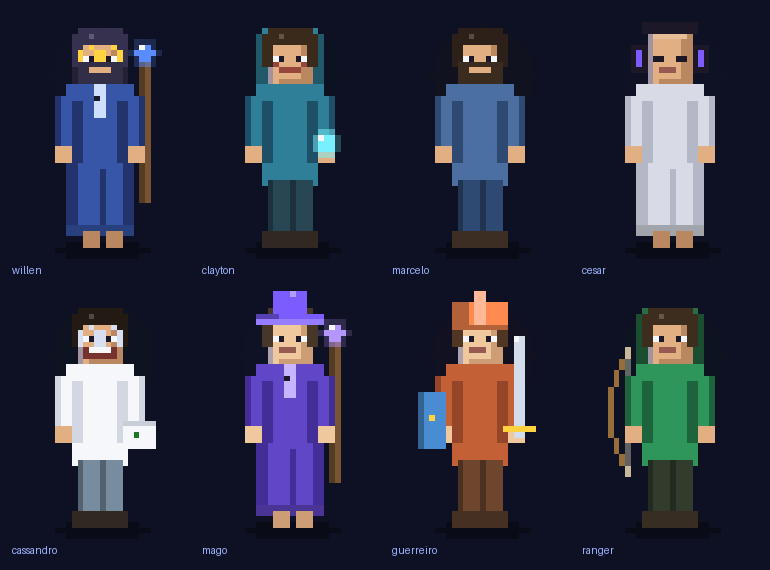
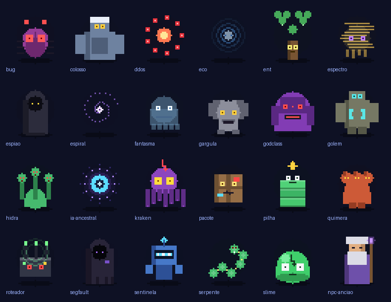
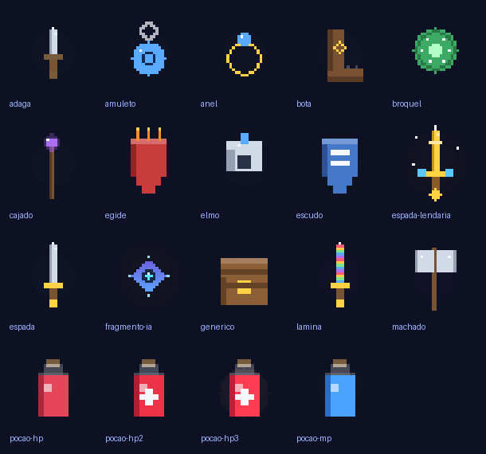
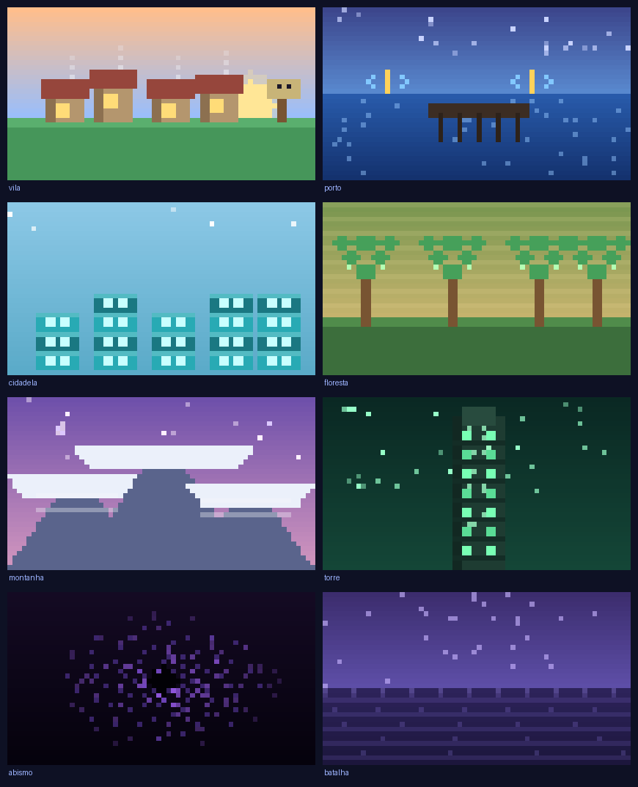

# ⚔️ Algorithmia — A Lenda dos Cinco Mestres

Um **RPG educativo** estilo *Duolingo + JRPG*, desenvolvido em **PHP puro** com arquitetura **MVC**, onde **programar é magia**. O jogador evolui um herói, vive uma história com múltiplos finais e aprende **PHP, MVC, SQL, POO, Estruturas de Dados, Cálculo e Redes** enfrentando bugs em batalhas por turnos.

> Projeto acadêmico (Laboratório de Programação II). Sistema novo, construído sobre o mesmo servidor MySQL do projeto anterior, sem frameworks — apenas PHP, PDO, HTML, CSS e JavaScript vanilla, com **arte pixel art autoral**.

---

## 🎮 O Jogo

Em **Algorithmia**, uma **IA Ancestral** já deu todas as respostas aos programadores — até falhar no *Grande Timeout* e quase destruir o reino. Os **Cinco Mestres** a selaram no Abismo do `/dev/null` e fundaram a Ordem do Código Limpo. Agora os Fragmentos da IA reaparecem, e você, um aprendiz da Vila Hello World, parte para treinar com os mestres.

Cada uso do **Fragmento da IA Ancestral** (que acerta um desafio automaticamente) reduz sua **reputação** e aproxima você do destino sombrio de **Lorde Segfault** — levando a um dos **três finais**.

### Os Cinco Mestres (inspirados em professores reais)

| Capítulo | Região | Mestre | Matérias |
|---|---|---|---|
| 1 | Porto da Sintaxe | **Willen Leolatto Carneiro** — *o Arquiteto* | PHP, MVC, SQL |
| 2 | Cidadela dos Objetos | **Clayton Zambon** — *o Moldador* | POO |
| 3 | Floresta das Estruturas | **Marcelo Goulart Souza** — *o Andarilho* | Estruturas de Dados |
| 4 | Montanha do Cálculo | **Cesar Augusto Machado Freitas** — *o Oráculo do Ritmo* | Lógica / Cálculo |
| 5 | Torre das Conexões | **Cassandro Albino Devenz** — *o Mensageiro* | Redes de Computadores |

### Mecânicas
- **3 classes**: Mago do Backend, Guerreiro do Frontend, Ranger Fullstack.
- **Batalha por turnos**: acertar causa dano (com **combo** e **ataque especial**); errar custa HP e mostra uma **explicação pedagógica**.
- **6 tipos de desafio**: múltipla escolha, verdadeiro/falso, completar código, encontrar o erro, ordenar trechos e arrastar tokens.
- **Progressão**: XP, níveis, HP/MP, ouro, **mapa-múndi** com fases que se destravam em sequência e estrelas (1–3).
- **Inventário e Loja**: armas, escudos, acessórios e poções (comprar/vender/equipar/usar).
- **Conquistas**, **ranking** e **perfil** com estatísticas de acerto por matéria.
- **Painel do Mestre** (admin): CRUD completo de fases, desafios e itens.
- **Narrativa com humor ácido**: diálogos, descrições e mensagens num tom sarcástico e autoconsciente — sem comprometer a precisão das explicações dos desafios.

---

## 🖼️ Galeria (pixel art autoral)

Toda a arte foi criada em **pixel art** por scripts próprios (`tools/`), sem IA.

### 👥 Personagens — os 5 Mestres e as 3 classes jogáveis


### 👹 Inimigos & Chefes — o bestiário (inclui Lorde Segfault e a IA Ancestral)


### ⚔️ Itens — armas, escudos, poções e relíquias


### 🏞️ Cenários — as regiões do mundo


> 📖 A **história completa** (lore, mestres, vilão e os três finais) está em
> [`historia.html`](historia.html) — uma página ilustrada; abra no navegador.

---

## 🗂️ Arquitetura (MVC)

```
TrabalhoWillen2/
├── index.php                 # Front Controller (roteia ?url=controller/metodo/param)
├── config/
│   ├── db.php                # Conexão PDO com o banco 'algorithmia'
│   └── config.php            # Constantes do jogo (classes, XP, dano, reputação)
├── database/
│   ├── schema.sql            # 13 tabelas (CREATE IF NOT EXISTS — não-destrutivo)
│   ├── seeds.sql             # mestres, 35 fases, 112 desafios, itens, conquistas, diálogos
│   └── migrate.php           # CLI: cria/atualiza o banco preservando dados
├── app/
│   ├── core/                 # Router, Controller, Model, Auth, helpers (núcleo MVC)
│   ├── controllers/          # Home, Auth, Mapa, Historia, Batalha, Inventario, Loja, Perfil, Ranking, Mestre
│   ├── models/               # Usuario, Personagem, Mestre, Fase, Desafio, Item, Inventario, ...
│   ├── services/             # BatalhaService, ProgressaoService, ReputacaoService, ConquistaService
│   └── views/                # Telas (HTML + PHP) organizadas por área
├── public/
│   ├── css/                  # style.css, mapa.css, batalha.css (tema JRPG, responsivo)
│   ├── js/                   # ui.js, app.js, dialogo.js, batalha.js (vanilla)
│   └── img/                  # 72 assets em pixel art PNG (mestres, heróis, inimigos, itens, ícones, cenários)
├── tools/                    # geradores de pixel art (Python/Pillow): pixelart, bestiario, itens, ui, cenarios
├── docs/
│   ├── REGRAS-DO-JOGO.md     # regras e balanceamento do jogo
│   └── FLUXO-OPENSPEC.md     # fluxo de desenvolvimento spec-driven (Claude + Codex)
├── openspec/                 # specs e propostas de mudança (spec-driven)
├── historia.html             # página da lore/história do jogo
└── imagensprofessores/       # fotos de referência usadas como base dos mestres
```

**Camadas**
- **Model** (`app/core/Model.php` + `app/models/`): acesso a dados via PDO com *prepared statements*.
- **Controller** (`app/core/Controller.php` + `app/controllers/`): orquestra requisição, regras e views.
- **View** (`app/views/`): apresentação; todo dado passa por `e()` (escape contra XSS).
- **Services**: regras de negócio reutilizáveis (batalha, progressão, reputação, conquistas).

---

## 🚀 Como Executar

### Pré-requisitos
- **PHP 8.0+** (com extensões `pdo` e `pdo_mysql`).
- **MySQL / MariaDB** em execução (em dev, o projeto usa `root` sem senha em `127.0.0.1`).

### 1. Configurar o banco
As credenciais são lidas de **variáveis de ambiente** (`DB_HOST`, `DB_NAME`, `DB_USER`, `DB_PASS`) e, se ausentes, caem para os padrões de desenvolvimento local. Para dev, em geral não precisa mexer em nada. Para um host, defina essas variáveis no ambiente do servidor **ou** edite os valores padrão em `config/db.php`.

### 2. Criar e popular o banco
Na raiz do projeto, rode o migrador (cria o banco `algorithmia`, as tabelas e todos os dados):

```bash
php database/migrate.php
```

Saída esperada: `✅ Banco 'algorithmia' pronto.` com a contagem de fases, desafios, etc.

**A migração é NÃO-DESTRUTIVA.** Rodar `php database/migrate.php` de novo **não apaga contas, personagens nem progresso** — só cria o que estiver faltando. Isso permite que vários jogadores (a turma) usem o mesmo banco e mantenham seus dados.

| Comando | O que faz |
|---|---|
| `php database/migrate.php` | Instala/atualiza **preservando** todos os dados dos jogadores. |
| `php database/migrate.php --reset` | **Apaga tudo** e recria do zero (use só para um começo limpo). |
| `php database/migrate.php --schema` | Apenas o schema (sem dados de conteúdo). |

> Alternativa: importar `database/schema.sql` e depois `database/seeds.sql` em qualquer cliente MySQL.

### 3. Iniciar o servidor
```bash
php -S localhost:8001
```
Acesse: **http://localhost:8001**

---

## ☁️ Deploy (hospedagem)

O projeto é PHP puro, sem dependências externas (não usa Composer), então roda em praticamente qualquer hospedagem com PHP 8+ e MySQL.

1. **Envie os arquivos** para o host (FTP/Git). Aponte o *document root* para a **raiz do projeto** (onde está o `index.php`).
2. **Banco de dados**: crie um MySQL no painel do host e configure as credenciais por variáveis de ambiente (`DB_HOST`, `DB_NAME`, `DB_USER`, `DB_PASS`) ou editando os padrões em `config/db.php`.
3. **Inicialize o banco** uma vez: rode `php database/migrate.php` via SSH **ou** importe `database/schema.sql` e `database/seeds.sql` pelo phpMyAdmin do host.
4. **Apache**: o `.htaccess` na raiz já faz o rewrite para o front controller. Em **Nginx**, direcione as requisições não-encontradas para `index.php`. O `BASE_URL` é detectado automaticamente, então funciona inclusive em subpastas.
5. **HTTPS**: recomendado em produção (a sessão e o login se beneficiam de cookies seguros).

---

## 👤 Acesso e Painel do Mestre

Não há contas pré-criadas — **crie a sua** em *Criar conta* e forje seu herói.

- **Jogador:** o registro cria uma conta comum (papel `jogador`).
- **Admin (Painel do Mestre):** para liberar o CRUD de fases, desafios e itens,
  promova sua conta a `mestre` direto no banco:
  ```sql
  UPDATE usuarios SET papel = 'mestre' WHERE email = 'seu@email.com';
  ```

---

## 🧪 Como testar o fluxo completo
1. Registre-se → crie um personagem (classe) → veja o **prólogo**.
2. No **mapa**, jogue *Os Primeiros Passos* e derrote *O Bug Primordial*.
3. Avance ao **Porto da Sintaxe** (Mestre Willen): teste os 6 tipos de desafio, use uma **poção**, o **especial** e o **Fragmento da IA** (veja a reputação cair e os diálogos mudarem).
4. Visite **Loja**, **Inventário**, **Perfil**, **Ranking**.
5. Promova sua conta a **Mestre** (veja *Acesso e Painel do Mestre*) e crie/edite/exclua um desafio no **Painel** — a mudança aparece na fase.

---

## 🛡️ Segurança e boas práticas
- **PDO + prepared statements** em todas as queries (proteção contra SQL Injection).
- **`htmlspecialchars`** (`e()`) em toda saída nas views (proteção contra XSS).
- **`password_hash` / `password_verify`** para senhas; **`session_regenerate_id`** no login.
- **Token CSRF** nos formulários POST.
- **Validação das respostas sempre no servidor** — o gabarito nunca é enviado ao cliente.
- **Sessões resilientes**: sessões órfãs (ex.: usuário removido do banco) são encerradas com elegância, sem derrubar a página.
- **Banco persistente**: a migração padrão preserva contas e progresso; apenas `--reset` apaga dados.
- **Sem credenciais embutidas**: nenhuma conta vem pré-criada no banco; o acesso de admin é concedido manualmente (promover a conta a `mestre`).

## 🎨 Créditos de arte
Todos os **72 assets** em `public/img/` são **pixel art autoral**, gerados por scripts próprios em `tools/` (Python/Pillow): mestres e heróis de **corpo inteiro**, 24 inimigos/criaturas, 19 itens, 13 ícones de UI e 8 cenários 16:9. Os cinco mestres foram estilizados a partir das fotos de referência em `imagensprofessores/`. Para regenerar/ajustar, rode `python3 tools/<arquivo>.py`.

## 🖥️ Camada visual / UX
- Tipografia de game: **Pixelify Sans** (títulos e HUD) + **Rubik** (corpo); **fundo estelar animado**, cenários por região e animações (investida na batalha, partículas, nós do mapa pulsando) para imersão.
- **Modal temático próprio** substitui os diálogos `confirm()`/`alert()` nativos do navegador (ver `public/js/ui.js`).
- **Rodapé fixado** ao fundo (sticky footer) e arena de batalha com profundidade (chão em perspectiva, brilho arcano).
- CSS em `public/css/` (`style.css`, `mapa.css`, `batalha.css`); JS vanilla em `public/js/` (`ui.js`, `app.js`, `dialogo.js`, `batalha.js`).

---

## 🤝 Colaboração & OpenSpec

O projeto usa **desenvolvimento orientado a especificação** com o **OpenSpec** —
toda mudança relevante nasce como uma **proposta** (`openspec/changes/`), é revisada
como spec, implementada e arquivada. O fluxo funciona para os dois colaboradores e
suas IAs: **Claude Code** (comandos `/opsx:*`) e **Codex** (skills em `.codex/skills/`).

**Instalar o OpenSpec** — repositório: **https://github.com/Fission-AI/OpenSpec/**
```bash
npm install -g @fission-ai/openspec   # ou: brew install openspec
openspec --version
```

| Ação | Claude Code | Codex |
|---|---|---|
| Propor mudança | `/opsx:propose "ideia"` | skill `openspec-propose` |
| Implementar | `/opsx:apply` | skill `openspec-apply-change` |
| Arquivar | `/opsx:archive` | skill `openspec-archive-change` |
| Ver estado (CLI) | `openspec list` · `openspec view` | (igual) |

📖 Guia completo: **[`docs/FLUXO-OPENSPEC.md`](docs/FLUXO-OPENSPEC.md)** ·
📜 Regras do jogo: **[`docs/REGRAS-DO-JOGO.md`](docs/REGRAS-DO-JOGO.md)**

---

*Algorithmia — A Lenda dos Cinco Mestres · Projeto MVC em PHP puro.*
